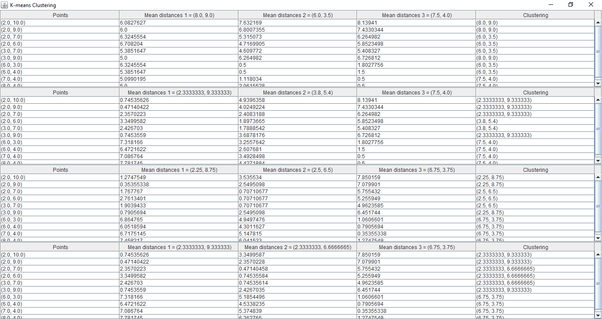

# k-means-clustering
Perform k-means clustering on the given 2d coordinates using either Manhattan or Euclidean distance.
The process is iterated and will be carried on until clustering is found to be same in the last 2 iterations.

The GUI containing the results looks like this:

